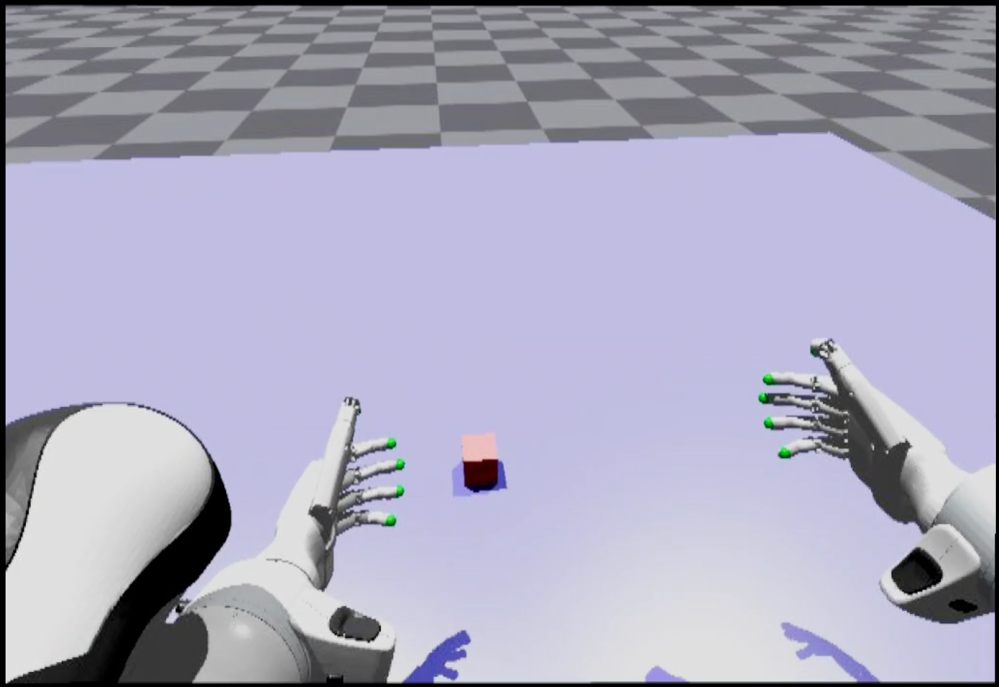

# Quest3-Teleop-in-Isaac-Gym

## Introduction
After modifications on **OpenTelevision**, Quest 3 can be used for teleoperation of the Franka Panda robotic arm and Inspire Hand in **Isaac Gym**.



## Installation

The operating system requirement is **Ubuntu 22.04**.

1. Install original OpenTeleVision environment.

```bash
    conda create -n tv python=3.8
    conda activate tv
    pip install -r requirements.txt
    cd act/detr && pip install -e .
    pip install 
```

2. Install Isaac Gym: https://developer.nvidia.com/isaac-gym/

3. Install Pinocchio, Pink and yourdfpy for IK computing
```bash
    pip install pin-pink
    pip install yourdfpy
```

Note: The **numpy** version required by **dex-retargeting-0.1.1** in OpenTeleVision may conflict with the **numpy** version required by **Pinocchio**. The **numpy-1.23.0** version specified by **dex-retargeting-0.1.1** should be used as the standard.

## Teleoperation with Quest3

### Local Streaming

1. Downloading and installing the Android SDK Platform Tools, which can be found in https://developer.android.com/tools/releases/platform-tools?hl=zh-cn.

2. Modify `~/.bashrc` to add the path of **adb tools** (`path/Android_SDK_Platform_Tools/platform-tools-latest-linux/platform-tools/`) to the environment variables.

3. Connect Quest3 to your computer with a USB cable. Put the Quest on and accept a prompt to allow the computer to connect with it.

4. Run `adb devices` from the terminal. You should see Quest3 is available.

5. Run `adb reverse tcp:8012 tcp:8012` in the terminal. 

### Teleoperation in Isaac Gym

1. Run python script `teleop_hand_with_franka`, and you should be able to see the Isaac Gym simulation environment on your computer.

2. Put Quest3 on and visit http://127.0.0.1:8012/ in browser.

3. Press `Enter VR` button in Quest3, then you are able to teleopoerate the franka panda and inspire hand in the VR with your own hands.


